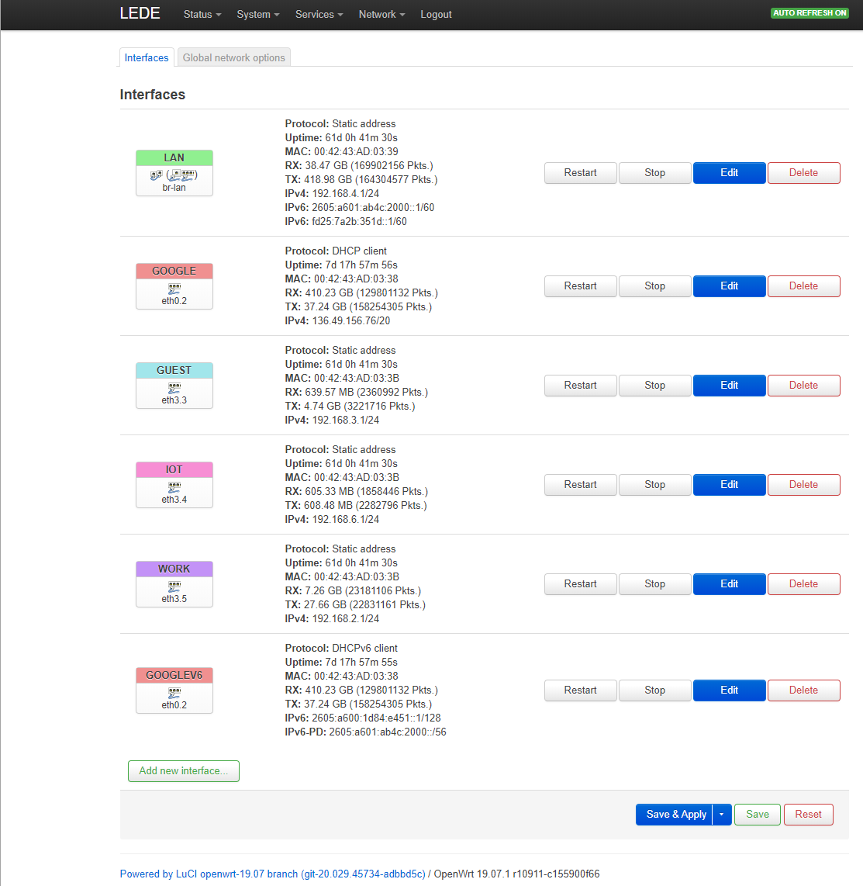
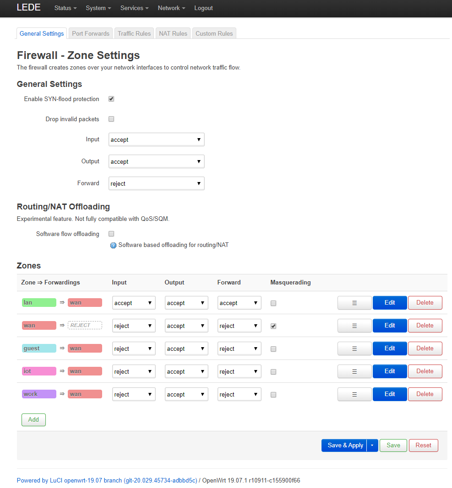

# Openwrt with Vlans for home networking

How I setup my in-home network with VLans using OpenWRT

## Introduction

As a professional in the devops and software development fields, I
spent a fair amount of my own time keeping up to date with the
developments in the field. I also enjoy hacking around with systems.

As such, I have spent a lot of time following the OpenWRT router
project. This project provides open source firmware for many varieties
of router. I have my home configured with a couple of OpenWRT
installations which allow me to do some more sophisticated than normal
network configurations.

Several of my friends and colleages have asked me about my
configuration, so I have documented it here. Please note: The usual
caveat about modifying your own hardware applies - this is an example
and should not be used verbatim. I can not be held responsible if you
brick your router or lock yourself out!

If you are not interested in advanced home networking, or you lack
computer skills this guide probably isn't for you.

### What is OpenWRT?

[OpenWRT](https://openwrt.org/) is a suite of tooling and packages
which allow you to replace stock firmware on a commerical home or soho
router with a customized version. This is a very good thing if you are
a professional in the software or IT space, or just have an interest in
leveraging more sophisticated firmware. It is also (despite recently
found issues) widely regarded as being more secure than default vendor
firmware as that has been plagued by backdoors, default credentials,
out of date packages with known vulnerabilities etc.

OpenWRT uses a Linux kernel and a userspace, along with a highly
sophisticated "buildroot" toolchain which provides many hundreds of
pre-packaged applications. Part of the toolchain is an "imagebuilder"
tool which allows you to easily make customized images for your
hardware.

OpenWRT supports an optional GUI called "LuCI" which although not
required, makes it somewhat easier to understand complex setups.

For a brief time OpenWRT was known as LEDE, and sometimes you will see
that name in this guide. At the time of writing I am using `19.07.1`
of OpenWRT.

### What is a VLan and why do I care?

A VLan is a Virtual Network (Software defined network) running on top
of your physical network layer. VLan packets are normal Internet
Protocol (IP) packets with an additional field in the header
containing a VLan number. VLans are isolated from each other such that
packets on VLan 1 will not be seen by VLan 2. See
[VLans](https://en.wikipedia.org/wiki/Virtual_LAN) for more
information.

This allows, for example, separation of my personal and work computers
by putting them into different VLans. The VLan containing my work
computer is allowed to reach out to the internet but not to open a
connection to my personal PC, and vice versa. In the event that one of
them became infected by a virus, then the other would be isolated from
it thus limiting the "spash damage" of the infection.

VLan ports appear under linux as a virtual port `.x` after the
ethernet port number, e.g. `eth0.2` is VLan 2 on port `eth0`. A packet
without a VLan tag sent to `eth0.2` will automatically be tagged with
VLan ID 2 then exit physical port `eth0`, and a packet received on
port `eth0` with a VLan ID tag of 2 will exit `eth0.2`.

Physical ports like `eth0` with multiple VLan ports are called "VLan
trunks" and are often used between routers or switches. This is how
VLans are preserved across my network of the gateway (SFF), WiFi AP
and managed switches as their interconnections are configured as VLan
trunks.

### What is a VPN?

A VPN is a different form of Virtual Private Network. Like a VLan it
is a software defined overlay network, but unlike VLans it uses
encyption to traverse untrusted 3rd party networks. VPNs are often
used to connect a business computer from your home to office, or
between geographically distributed sites over the internet.

## How is my network configured?

I am lucky enough to have a Google Fiber 1G up/down symmetrical fiber
connection. This connection enters my house as fiber and is
immediately converted to 1G ethernet via a dumb fiber-to-ethernet
converter. One advantage of that is that I can bin the Google head
unit/router/wifi and replace it with my own. So that is what I did.

### Firewall/Gateway router

I used a SFF X86 PC similar to this one:


[Protectli Vault 4 Port, Firewall Micro Appliance/Mini PC - Intel Quad Core, AES-NI, 8GB RAM, 120GB mSATA SSD
by protectli](https://www.amazon.com/dp/B07G9NHRGQ/ref=cm_sw_em_r_mt_dp_U_6MZMEbBEDB98D)

These are sold barebones (no RAM, SSD, or software), populated but
without software, or often with pfSense. pfSense is an alternative
firmware for customized firewalls, and widely regarded as easier to
use than OpenWRT. As, however, I was partly using this as a learning
exercise I wanted to use the less friendly version. I also wanted to
use a consistent router OS across my lan (more on this later).

If you buy one, make sure it supports the AES-NI instructions as they
help accelerate some functions like VPNs.

Installing OpenWRT on this box is trivial, boot the box off a USB
stick with linux on, download the x86-64 image from OpenWRT, and image
it onto the internal drive. Remove the USB stick and
reboot. Conveniently, these SFF boxes have a VGA out so you can
connect a screen and troubleshoot if anything goes wrong. More details
[from
OpenWRT](https://openwrt.org/docs/guide-user/installation/openwrt_x86)

If you have a large SSD, you may want to consider partitioning it or
expanding the file system to match.

In order to have this work with the Google fiber connection, Google
needs two "magic" numbers setting on the port connected to their
service.

VLAN = 2
Ethernet QoS = 3

These two magic numbers need to be set in OpenWRT, and this is where
the first part of customization begins (see below).

### VLan capable managed switches

The next component in my home LAN is a 1G x 8 managed switch. Mine are similar to these


[NETGEAR 8-Port Gigabit Smart Managed Plus Switch (GS308E)
by Amazon.com](https://www.amazon.com/dp/B07PLFCQVK/ref=cm_sw_em_r_mt_dp_U_B0ZMEb3T0PQNG)

The important characteristics to note are the switch MUST be "managed"
and MUST support "Basic VLAN & QoS". These switches are also available
with Power-Over-Ethernet (PoE) which is particularly useful for
devices like security cameras, or can power a Raspberry Pi 4 computer.

I have two of these, and I will explain the configuration below.

### WiFi access point and Router

The last component in my home network is a WiFi router. Note that the
SFF PC does not have WiFI capability. Some do, but don't do it as well
as commercial ones. I chose my home router very carefully as I wanted
to ensure that all the components are well supported by OpenWRT.


[NETGEAR Nighthawk X4S Smart WiFi Router (R7800) - AC2600 Wireless
Speed (up to 2600 Mbps) | Up to 2500 sq ft Coverage & 45 Devices | 4 x
1G Ethernet, 2 x 3.0 USB, and 1 x eSATA
ports](https://www.amazon.com/dp/B0192911RA/ref=cm_sw_em_r_mt_dp_U_i6ZMEbBK613V5)

The first thing I did after unboxing and powering on this router is
use the built-in firmware upgrade function to replace the firmware
with OpenWRT. This was an extremely easy and quick process. As a
bonus, I can use one of the onboard USB ports to power the
fiber-to-ethernet converter and get rid of a wall-wart.

### Uninterruptable Power Supplies

It is important in the region I am in to have an Uninterruptable Power
Supply (UPS). All of my routers and switches and my main PC are all on
UPS. This allows me to continue working during short power outages,
protects the equipment from surges, and allows for a controlled
shutdown for longer outages.

## Configuration

My desired configuration is to have multiple VLans in the house, each of which is isolated from the others.

* VLan-2 is required by Google for the upstream link. All packets exiting the SFF router to the fiber-to-ethernet adapter are required to be tagged with VLan-2, QoS-3
* VLan-3 is my guest network. Devices on this network may only access the internet and not devices on the other VLans.
* VLan-4 is my Internet-of-Things (IoT) network. This is where I put all of my devices like Nest Thermostats, Security Cameras etc.
* VLan-5 is my work network, where my corporate provided Macbook lives

Although IPv6 is enabled on my configuration, I will keep this configuration to IPv4 only for simplicity.

Each VLan also has corresponding WiFi SSID on the B and G wavelengths
on the WiFi access point. Whilst it is possible to also run a WiFi AP
signon page, my guest network uses a WiFi password which is known to
my friends.

### Firewall/Internet Gateway Router configuration

#### Core configuration

The ethernet port mapping and network configuration is as follows:



```shell
root@LEDE:/etc/config# cat system

config system
        option hostname 'LEDE'
        option timezone 'UTC'
        option ttylogin '0'
        option log_size '64'
        option urandom_seed '0'

config timeserver 'ntp'
        option enabled '1'
        option enable_server '0'
        list server '0.lede.pool.ntp.org'
        list server '1.lede.pool.ntp.org'
        list server '2.lede.pool.ntp.org'
        list server '3.lede.pool.ntp.org'
	
root@LEDE:/etc/config# cat network

config interface 'loopback'
        option ifname 'lo'
        option proto 'static'
        option ipaddr '127.0.0.1'
        option netmask '255.0.0.0'

config interface 'lan'
        option type 'bridge'
        option proto 'static'
        option netmask '255.255.255.0'
        option _orig_ifname 'eth0'
        option _orig_bridge 'true'
        option ipaddr '192.168.4.1'
        option ifname 'eth1 eth3.1'

config interface 'google'
        option proto 'dhcp'
        option ifname 'eth0.2'

config interface 'guest'
        option proto 'static'
        option ipaddr '192.168.3.1'
        option netmask '255.255.255.0'
        option ifname 'eth3.3'

config interface 'iot'
        option proto 'static'
        option ipaddr '192.168.6.1'
        option netmask '255.255.255.0'
        option ifname 'eth3.4'

config interface 'work'
        option proto 'static'
        option ifname 'eth3.5'
        option ipaddr '192.168.2.1'
        option netmask '255.255.255.0'

root@LEDE:/etc/config# cat dhcp

config dnsmasq
        option domainneeded '1'
        option localise_queries '1'
        option rebind_protection '1'
        option rebind_localhost '1'
        option local '/lan/'
        option domain 'lan'
        option expandhosts '1'
        option authoritative '1'
        option readethers '1'
        option leasefile '/tmp/dhcp.leases'
        option resolvfile '/tmp/resolv.conf.auto'
        option localservice '1'
        option nonwildcard '0'
        option serversfile '/tmp/adb_list.overall'
        list server '8.8.8.8'
        list server '4.4.4.4'

config dhcp 'lan'
        option interface 'lan'
        option leasetime '12h'
        option ra 'server'
        option ra_management '1'
        option start '50'
        option limit '175'

config dhcp 'wan'
        option interface 'wan'
        option ignore '1'

config odhcpd 'odhcpd'
        option maindhcp '0'
        option leasefile '/tmp/hosts/odhcpd'
        option leasetrigger '/usr/sbin/odhcpd-update'

config host
        option mac '00:D2:6D:9F:A6:92'
        option ip '192.168.4.202'
        option name 'msi'
        option dns '1'

config dhcp 'veth2'
        option leasetime '12h'
        option interface 'veth2'
        option start '90'
        option limit '99'

config dhcp 'guest'
        option start '100'
        option leasetime '12h'
        option limit '150'
        option interface 'guest'

config dhcp 'iot'
        option start '100'
        option leasetime '12h'
        option limit '150'
        option interface 'iot'

config dhcp 'work'
        option interface 'work'
        option start '100'
        option limit '150'
        option leasetime '12h'

```

Notes:

* Ethernet port `eth1` is the wired lan
* The WiFi access point is connected to ethernet port `eth3`
* The `eth1` and `eth3` are in a bridge for the LAN
* The `eth1` and `eth3` ports are configured as
  VLan Trunks. This means they support multiple VLans for ingress, and
  for egress they have VLan virtual interfaces like `eth3.1`
* The network has several subnets. `192.168.4.1` is the primary lan,
  but the guest network is on `192.168.3.1`. This allows us to
  separate them in the firewall.

#### Firewall configuration



Note that the firewall rules between zones prohibit traffic. This is
overriden by extra rules to ensure that only the correct VLan routes
are enabled. DHCP is specifically enabled so that all the
VLans/Subnets may access the DHCP server.

```shell
root@LEDE:/etc/config# cat firewall

config rule
        option name 'Allow-DHCP-Renew'
        option src 'wan'
        option proto 'udp'
        option dest_port '68'
        option target 'ACCEPT'
        option family 'ipv4'

config rule
        option name 'Allow-Ping'
        option src 'wan'
        option proto 'icmp'
        option icmp_type 'echo-request'
        option family 'ipv4'
        option target 'ACCEPT'

config rule
        option name 'Allow-IGMP'
        option src 'wan'
        option proto 'igmp'
        option family 'ipv4'
        option target 'ACCEPT'

config rule
        option target 'ACCEPT'
        option src 'wan'
        option proto 'tcp'
        option dest_port '22'
        option name 'External SSH'

config rule
        option target 'ACCEPT'
        option src 'guest'
        option name 'Allow DNS/DHCP for Guest'
        option dest_port '67 68 53'
        list proto 'tcp'
        list proto 'udp'

config defaults
        option syn_flood '1'
        option input 'ACCEPT'
        option output 'ACCEPT'
        option forward 'REJECT'

config zone
        option name 'lan'
        option input 'ACCEPT'
        option output 'ACCEPT'
        option forward 'ACCEPT'
        option network 'lan'

config zone
        option name 'wan'
        option input 'REJECT'
        option output 'ACCEPT'
        option forward 'REJECT'
        option masq '1'
        option mtu_fix '1'
        option network 'google googlev6'

config include
        option path '/etc/firewall.user'

config forwarding
        option dest 'wan'
        option src 'lan'

config zone
        option name 'guest'
        option output 'ACCEPT'
        option network 'guest'
        option input 'REJECT'
        option forward 'REJECT'

config forwarding
        option dest 'wan'
        option src 'guest'

config zone
        option name 'iot'
        option input 'REJECT'
        option network 'iot'
        option output 'ACCEPT'
        option forward 'REJECT'

config forwarding
        option dest 'wan'
        option src 'iot'

config rule
        option target 'ACCEPT'
        option name 'Allow DNS/DHCP for IOT'
        option dest_port '53 67 68'
        option src 'iot'
        list proto 'tcp'
        list proto 'udp'

config zone
        option name 'work'
        option input 'REJECT'
        option output 'ACCEPT'
        option forward 'REJECT'
        option network 'work'

config forwarding
        option src 'work'
        option dest 'wan'

config rule
        option name 'Allow DNS/DHCP for Work'
        option src 'work'
        option dest_port '53 67 68'
        option target 'ACCEPT'
        list proto 'tcp'
        list proto 'udp'

config include 'miniupnpd'
        option type 'script'
        option path '/usr/share/miniupnpd/firewall.include'
        option family 'any'
        option reload '1'

```

#### Google Upsteam link

In order to communicate correctly with the Google upstream servers,
every boot the SFF PC needs to set the VLan and QoS on the network
interface, in my case `eth0` is the one connected to the Google fiber,
so I aliased it to `google`.

This script achieves it. You also need to enable the full version of
the `ip` tool as OpenWRT defaults to a cut-down simpler version. This
can be done from the LUCI GUI System/Software menu or from the command
line. I am using SSH to the gateway here, that can also be configured
in LUCI, I recommend not doing that on the WAN interface at this
point.

```shell
root@LEDE:/etc/hotplug.d/iface# opkg update
Downloading http://downloads.openwrt.org/releases/19.07.1/targets/x86/64/packages/Packages.gz
Updated list of available packages in /var/opkg-lists/openwrt_core
Downloading http://downloads.openwrt.org/releases/19.07.1/targets/x86/64/packages/Packages.sig
Signature check passed.
Downloading http://downloads.openwrt.org/releases/19.07.1/packages/x86_64/base/Packages.gz
Updated list of available packages in /var/opkg-lists/openwrt_base
Downloading http://downloads.openwrt.org/releases/19.07.1/packages/x86_64/base/Packages.sig
Signature check passed.
Downloading http://downloads.openwrt.org/releases/19.07.1/packages/x86_64/luci/Packages.gz
Updated list of available packages in /var/opkg-lists/openwrt_luci
Downloading http://downloads.openwrt.org/releases/19.07.1/packages/x86_64/luci/Packages.sig
Signature check passed.
Downloading http://downloads.openwrt.org/releases/19.07.1/packages/x86_64/packages/Packages.gz
Updated list of available packages in /var/opkg-lists/openwrt_packages
Downloading http://downloads.openwrt.org/releases/19.07.1/packages/x86_64/packages/Packages.sig
Signature check passed.
Downloading http://downloads.openwrt.org/releases/19.07.1/packages/x86_64/routing/Packages.gz
Updated list of available packages in /var/opkg-lists/openwrt_routing
Downloading http://downloads.openwrt.org/releases/19.07.1/packages/x86_64/routing/Packages.sig
Signature check passed.
Downloading http://downloads.openwrt.org/releases/19.07.1/packages/x86_64/telephony/Packages.gz
Updated list of available packages in /var/opkg-lists/openwrt_telephony
Downloading http://downloads.openwrt.org/releases/19.07.1/packages/x86_64/telephony/Packages.sig
Signature check passed.
root@LEDE:/etc/hotplug.d/iface# opkg install ip
Package ip-full (5.0.0-2.1) installed in root is up to date.
```

Create the script in the hotplug.d/iface directory and it will be
executed every time the `google` interface comes up.

```shell
root@LEDE:/etc# cd hotplug.d/iface/
root@LEDE:/etc/hotplug.d/iface# ls -l
-rw-r--r--    1 root     root           155 Jan 29 16:05 00-netstate
-rw-------    1 root     root           336 Jan 29 16:05 20-firewall
-rw-r--r--    1 root     root          1618 Feb 11 12:41 20-ntpclient
-rw-r--r--    1 root     root           990 Feb 20 08:17 50-miniupnpd
-rwxr-xr-x    1 root     root           204 Feb 11 12:41 95-ddns
-rwxr-xr-x    1 root     root           220 Feb 17 01:02 99-google
root@LEDE:/etc/hotplug.d/iface# cat 99-google
#!/bin/sh
[ "${ACTION}" = "ifup" -a "${INTERFACE}" = "google" ] && {
    logger -t hotplug "Device: ${DEVICE} / Action: ${ACTION} google enable performance mode"
    /sbin/ip link set eth0.2 type vlan id 2 egress 0:3
}
```

### Switch Configuration

I have two managed switches in my network, one downstairs (#1) and one
upstairs (#2). The first switch #1 has one port connected to the SFF
Gateway port `eth3`, and that port is configured as a VLan Trunk port
on both sides. The second switch is connected to port 8 of the first,
although I could have used a port on the SFF gateway this was slightly
more convenient for me.

Remember, VLan-2 is reserved for Google uplink.

So the configuration on that switch is as follows:

Port | VLans
---- | ------
1 | 1,3,4,5 - Uplink VLan trunk to gateway `eth3` 
2 | 3 - Guest
3 | 4 - IOT - Solar Power controller
4 | 4 - IOT - Switch TV
... | ...
7 | 1 - LAN
8 | 1,3,4,5 - Downlink VLAN trunk to switch #2

Switch #2 is configured similarly with Port 1 being its uplink to switch
#1

Note that any device plugged into a port with a single VLan tag will
have all its packets tagged with that VLan. This is how non-VLan aware
devices are introduced into a VLan enabled network. Similarly, as a
packet tagged with the VLan exits that port, the VLan tag will be
_removed_ .

### WiFi AP configuration

The WiFi Access Point I use (Netgear Nighthawk X4S R7800) is a very
sophisticated and expensive piece of equipment. Needless to say, I
violated the warranty immediately.

This device has a [Dual core ARMv7 processor at the heart, 512M of RAM
and 128M of flash](https://openwrt.org/toh/netgear/r7800). It is a
beast! It is also extremely well supported by OpenWRT. Once very nice
feature is a built in fallback mode which makes it very easy to
recover if you "brick" it during flashing OpenWRT.

In addition to the core CPU, it has a dual band WiFi radio and an
internal/external 1G switch with 4 external ports, 2 CPU ports and a
WAN uplink port. The WiFi radios are attached to the CPU internal PCI
bus.

As per the switch configuration on the managed switches, the "WAN"
port on the Netgear is configured as a VLan trunk port and is attached
to the `eth1` port on the gateway SFF. Note that in the Gateway bridge
configuration the `lan` bridge contains the `eth1` port not `eth1.x`,
so the bridge includes *all* the VLans on `eth1`. This also means that
the VLan tags are preserved and not stripped like they would be for a
`ethx.y` interface.

It is configured with multiple SSIDs, one per VLan. Each SSID tags the
packets with the corresponding VLan ID as it is bridged with the
corresponding VLan virtual port on the uplink trunk connector. For
example, Guest SSID is configured to be bridged to `eth0.3` where
`eth0` is the WAN port connected to the gateway. So the gateway will
see any WiFi client connected to "Guest" SSID as VLan 3.

All traffic is routed to the gateway so that I can keep my firewall
rules centralized.


