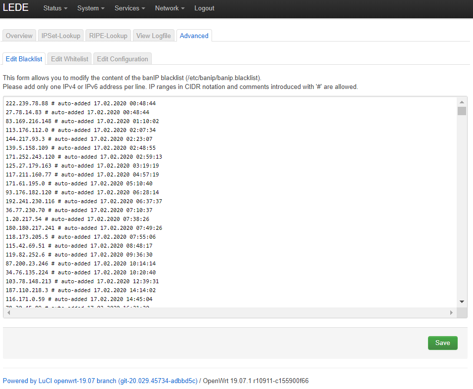
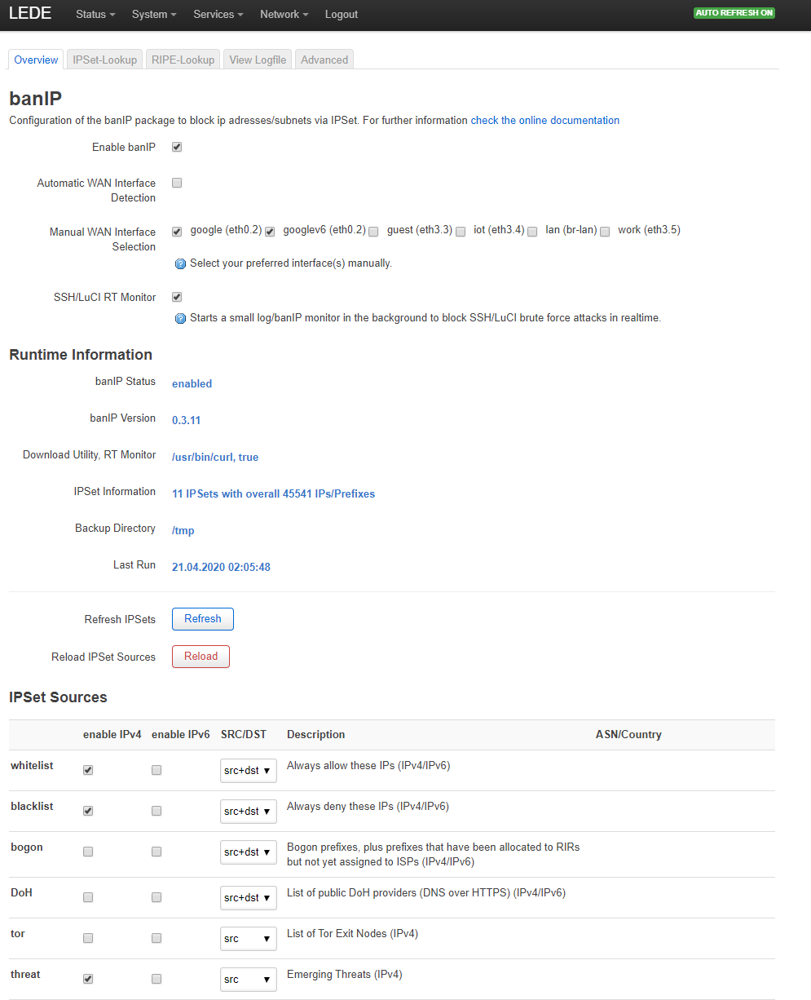

# BanIP

This software runs on the gateway and is installed using LuCI software
manager or the command line tool `opkg`

One of the more important pieces of software I run on my gateway is
`banIP`. This package is similar to the popular "fail2ban" package
many other systems use. The role it performs is to monitor the log
files for suspicious activity - in this case determined as multiple
failed SSH login attempts - on the external interface (`google`)

Once it sees one, it adds that address to a 'blacklist' of IPs.

In addition to this auto-generated list of potential threats, it may
also use one or more of a number of curated lists to pre-populate the
ban tables.

It is not installed or configured by default in OpenWRT but may be
easily applied via the `opkg` command line tool or via LuCI.

My config is available:

* [banip config](configs/gateway/etc/config/banip)

Note: In order for banIP to work, the utilities it watches must have
their log files enabled.
